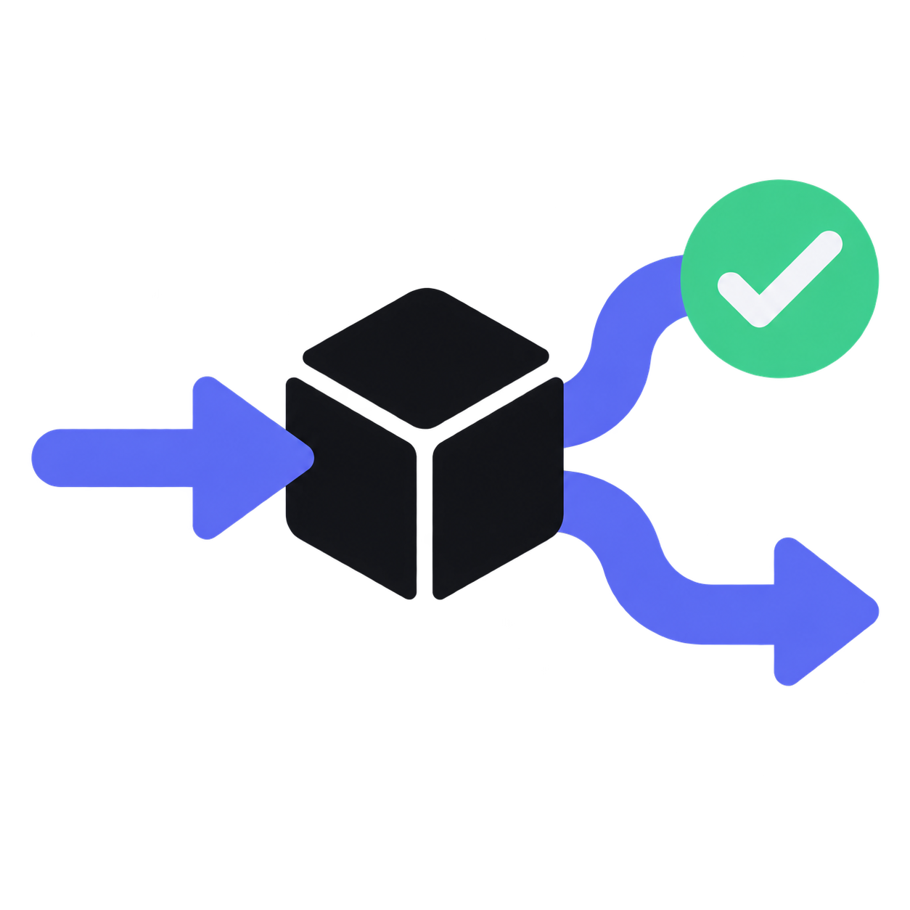
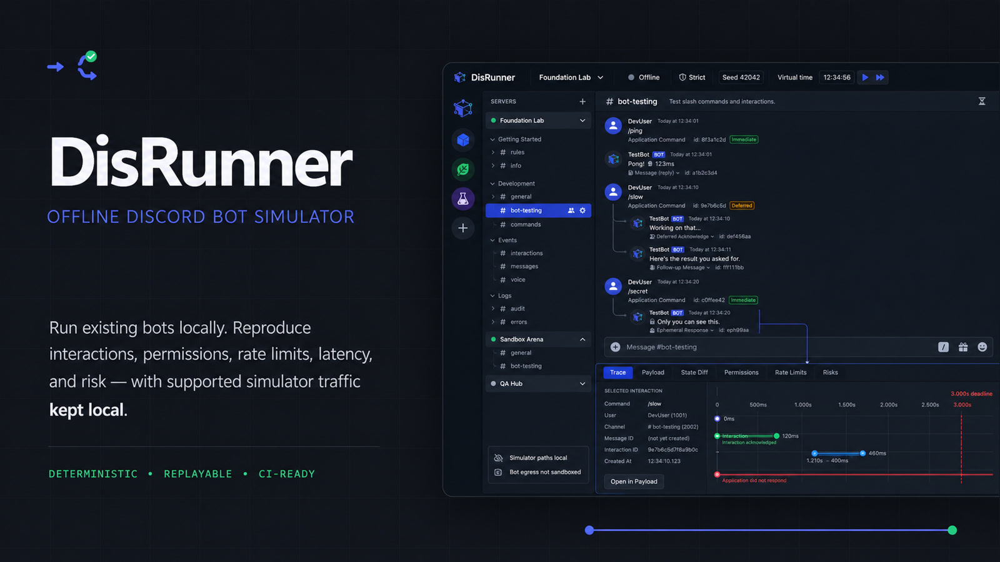

# DisRunner

<p align="center">
  
</p>

<p align="center">
  <strong>Build deterministic Discord-shaped tests locally, without connecting DisRunner to Discord.</strong>
</p>

<p align="center">
  <a href="https://github.com/YanagiKH/DisRunner/actions/workflows/ci.yml"></a>
  <a href="https://github.com/YanagiKH/DisRunner/actions/workflows/security.yml"></a>
  <a href="https://github.com/YanagiKH/DisRunner/releases"></a>
  <a href="LICENSE"></a>
</p>

> [!IMPORTANT]
> **v0.1 is a Preview, not a complete Discord or Discord SDK replacement.** The tested product today is a deterministic core library and CLI, a signed raw-interaction-webhook example, and a narrow Electron path that starts that example and invokes its real local `/ping` handler. Most guild, command, scenario, inspector, and risk screens are visual previews.

DisRunner's goal is to let existing bots exercise Discord-shaped interactions, events, permissions, limits, timing, and failure cases without a live Discord connection. The v0.1 Preview establishes the deterministic testing foundation; framework adapters and the fully connected desktop simulation remain roadmap work.



DisRunner is independent software and is not affiliated with, endorsed by, or sponsored by Discord Inc. Discord is a trademark of Discord Inc. The project does not include Discord logos or proprietary client assets.

## What works in v0.1

- **Core library:** deterministic virtual state, Snowflake-like IDs, seeded randomness, virtual time, snapshots/state hashes, interaction lifecycle rules, permission calculation, intent filtering, rate-limit primitives, a partial Gateway/REST model, traces, assertions, and a small set of risk findings.
- **CLI:** validate and run version 1 scenario files; record and verify deterministic replays; export JSON, JUnit, HTML, and SARIF reports.
- **Raw webhook example:** a local Node.js process that verifies signed interaction requests and returns Discord-shaped callbacks.
- **Electron vertical slice:** validate a project config, start/stop the raw webhook process, capture bounded stdout/stderr, perform signed readiness checks, send a real local `/ping`, and render its callback result.
- **Desktop visual preview:** Discord-like multi-guild/channel fixtures and concept surfaces for the Guild Editor, Command Explorer, Scenario Lab, inspector, Risk Center, and Settings.

The following are **not** v0.1 compatibility claims:

- drop-in `discord.js` or `discord.py` execution;
- a generic HTTP/WebSocket/stdio bot adapter;
- persistent editing in the desktop Guild Editor or Scenario Lab;
- end-to-end synchronization among desktop fixtures, REST state, and Gateway events;
- desktop controls for arbitrary latency, packet duplication/drop/reorder, or process performance profiling;
- complete Discord routes, events, object limits, permissions, rate limits, or client behavior.

See [Compatibility](COMPATIBILITY.md) for the support boundary.

## Environment targets

Source development requires Node.js `>=22.23.2 <23` and pnpm `11.19.0`.

| Target                       | v0.1 status                                                   |
| ---------------------------- | ------------------------------------------------------------- |
| Windows 11 x64 / NSIS        | Preview target; support requires a green release run          |
| macOS 14+ arm64/x64 / DMG    | Preview target; signing/notarization depends on release setup |
| Ubuntu 24.04+ x64 / AppImage | Preview target; support requires a green release run          |

| Bot integration         | v0.1 status | Notes                                                               |
| ----------------------- | ----------- | ------------------------------------------------------------------- |
| Raw interaction webhook | Preview     | Bundled Node example and Electron `/ping` path are tested           |
| `discord.js`            | Planned     | Rejected by v0.1 project validation; no compatible version declared |
| `discord.py`            | Planned     | Rejected by v0.1 project validation; no compatible version declared |
| Generic Gateway/stdio   | Planned     | Core transport/process primitives are not a public adapter contract |
| Simulator SDK           | Planned     | No public SDK package in v0.1                                       |

## Quick start

```bash
git clone https://github.com/YanagiKH/DisRunner.git
cd DisRunner
corepack enable
corepack prepare pnpm@11.19.0 --activate
pnpm install --frozen-lockfile
pnpm run verify
```

Run a deterministic core scenario:

```bash
pnpm run cli -- run scenarios/interaction-lifecycle.discord-scenario.yml --seed 42
pnpm run cli -- report scenarios/interaction-lifecycle.discord-scenario.yml --format json --out disrunner-report.json
```

Record and verify a replay:

```bash
pnpm run cli -- record scenarios/interaction-lifecycle.discord-scenario.yml --out recording.json --seed 42
pnpm run cli -- replay recording.json --out verification.json
```

Start the Electron preview:

```bash
pnpm run dev
```

In **Settings → Runtime paths**, choose `examples/raw-webhook-bot`, start the bot, and invoke `/ping`. The browser-only renderer started by `pnpm run dev:web` uses synthetic data and cannot manage a real bot process.

Read [Installation](docs/installation.md), [Getting started](docs/getting-started.md), and [Project configuration](docs/project-configuration.md) for the exact workflow.

## Offline boundary

DisRunner's own supported protocol path uses loopback endpoints, synthetic credentials, and no live Discord token. The compatibility-layer network helper rejects Discord destinations and supported logs/reports are redacted.

This is an application-level boundary, **not an operating-system sandbox for an imported bot**. A bot, dependency, install script, native module, or child process can open its own network connection. Run untrusted code only inside the documented [hard-isolation setup](docs/offline-mode.md#hard-isolation), and never provide a production token.

## Architecture in this preview

```text
Scenario files ──> deterministic core ──> traces, assertions, reports
                         │
                         └──────────────> CLI record/replay

Electron ──> validated raw-webhook project ──> signed local /ping callback
    │
    └──────> Discord-like visual preview (partly synthetic)
```

The core contains additional REST, Gateway, permission, intent, and rate-limit primitives. In v0.1 they are primarily exercised directly by core/CLI tests; their presence does not mean every desktop or imported-bot path is wired end to end.

## Limits

- Discord can change independently of this project.
- The current REST and Gateway catalogs are partial.
- Desktop fixtures and most inspector panels are not authoritative runtime state.
- Generic fault injection and imported-process CPU/memory/event-loop profiling are planned.
- Voice transport, encryption, audio, CDN behavior, regional routing, anti-abuse systems, and undocumented desktop behavior are out of scope.
- Simulation reduces risk; it cannot guarantee production correctness or absence of vulnerabilities.

See [Known limitations](docs/limitations.md) and [Protocol compatibility](docs/protocol-compatibility.md).

## Documentation

- [Installation](docs/installation.md) · [Getting started](docs/getting-started.md) · [Project configuration](docs/project-configuration.md)
- [Interface tour](docs/ui-tour.md) · [Architecture](docs/architecture.md) · [Known limitations](docs/limitations.md)
- [Offline mode](docs/offline-mode.md) · [Security model](docs/security-model.md) · [Threat model](docs/threat-model.md) · [Privacy](docs/privacy.md)
- [Gateway](docs/gateway-emulator.md) · [REST](docs/rest-emulator.md) · [Interactions](docs/interaction-engine.md)
- [Permissions](docs/permission-engine.md) · [Rate limits](docs/rate-limit-engine.md) · [Fault injection status](docs/fault-injection.md)
- [Scenarios](docs/scenario-format.md) · [Assertions](docs/assertions.md) · [Tracing](docs/trace-system.md) · [Risk rules](docs/risk-engine.md)
- [Debugging](docs/debugging.md) · [Troubleshooting](docs/troubleshooting.md) · [Release process](docs/release-process.md)

## Project status

DisRunner follows semantic versioning. Preview versions before `1.0.0` may change configuration and output contracts; only fields and behavior explicitly listed in [Compatibility](COMPATIBILITY.md) are commitments. Follow the [roadmap](ROADMAP.md) and [changelog](CHANGELOG.md), and pin CI to a known release.

Read [CONTRIBUTING.md](CONTRIBUTING.md) before contributing. Report security issues according to [SECURITY.md](SECURITY.md). DisRunner is available under the [MIT License](LICENSE).
