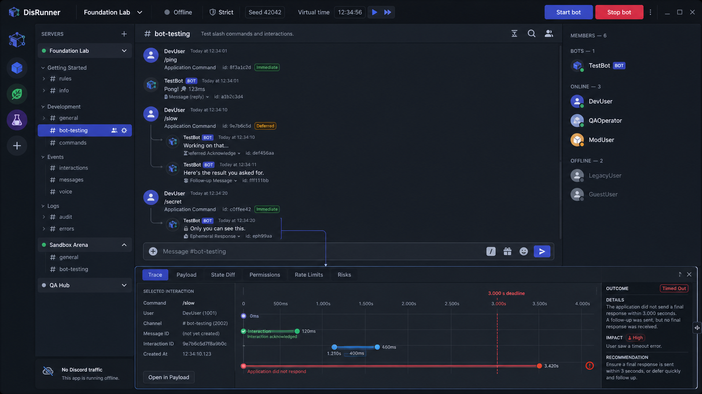
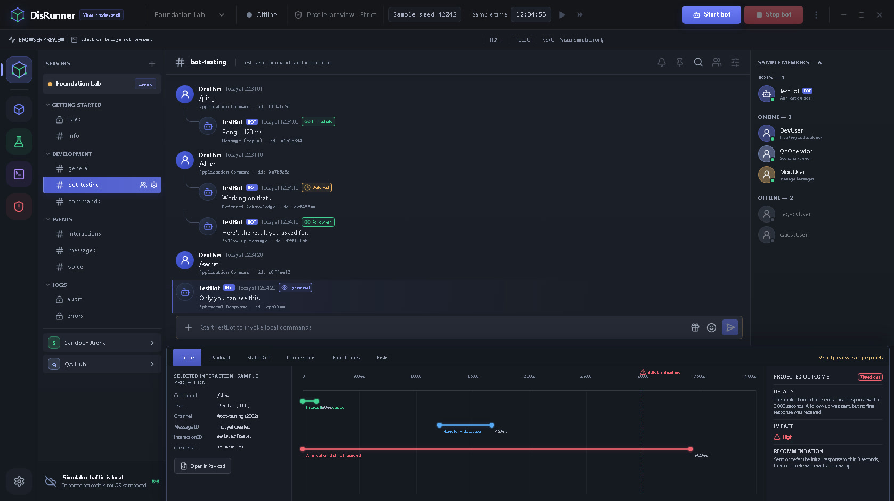

# Interface tour

The v0.1 desktop combines a real narrow Electron runtime path with a larger visual product preview. A rendered screen is not evidence that every control is persisted or connected to the core.

The image above is a design concept. The image below is a renderer snapshot used for visual regression/reference, not a claim of end-to-end protocol behavior.

## Runtime-backed in Electron

- **Settings → Runtime paths → Browse** selects a folder containing `discord-simulator.config.json` and shows validated command/profile details.
- **Start/Stop Bot** controls the selected raw-webhook process and local services.
- **Runtime strip** shows phase, PID, resolved command, error/latest bounded stdout or stderr.
- **Composer or Command Explorer `/ping`** invokes the running raw-webhook bot through a signed local request and displays its callback result.
- **Risk Center** can receive findings recorded by the current runtime path.

The bundled `/ping` example is the v0.1 Electron acceptance path. Other command names work only if the selected raw-webhook process implements them; static command metadata is not registration discovery.

## Visual-preview surfaces

| Surface          | v0.1 behavior                                                                                                         |
| ---------------- | --------------------------------------------------------------------------------------------------------------------- |
| Guild/channel UI | Seeded synthetic guilds, channels, members, history, and selection; not synchronized with core REST/Gateway state     |
| Guild Editor     | Local form interaction only; Save does not write a fixture                                                            |
| Command Explorer | Static command shapes/options; Invoke forwards the selected name to Electron when a runtime exists                    |
| Scenario Lab     | Illustrative scenarios/timeline; Run does not call the core/CLI scenario engine                                       |
| Inspector        | Latest runtime callback outcome/duration plus illustrative trace, payload, diff, permission, bucket, and risk details |
| Risk Center      | Runtime entries can display; export, history, baseline, suppression, and trend data are not persisted                 |
| Settings         | Project selection is real; most toggles, sections, and Save settings are not persisted                                |
| Browser renderer | Entirely synthetic because the Electron preload/runtime bridge is absent                                              |

## Visual anatomy

1. **Run header** — project status, preview mode/seed/time labels, and start/stop controls.
2. **Workspace rail** — switches among simulator and preview product surfaces.
3. **Guild/channel tree** — synthetic navigation fixtures.
4. **Message flow** — seeded messages plus the latest callback rendered in the selected visual channel.
5. **Member panel** — synthetic members.
6. **Evidence inspector** — mixed runtime/illustrative fields as described above.

## Accessibility status

The renderer uses labeled controls, keyboard-focusable native elements, status text in addition to color, and responsive panel rules where implemented. A complete keyboard, screen-reader, contrast-state, localization, and high-DPI audit has not been completed; accessibility is a release criterion, not a blanket v0.1 guarantee.

All bundled identities/content are synthetic. DisRunner does not ship Discord logos, branded server art, or private production conversations.
